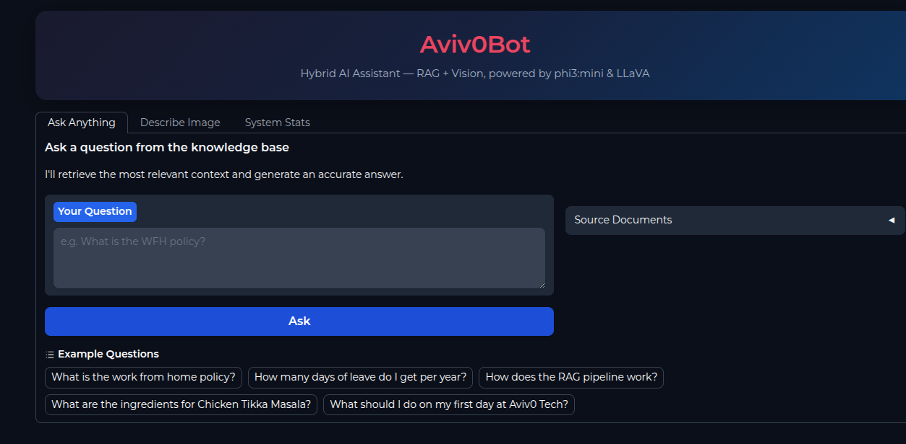
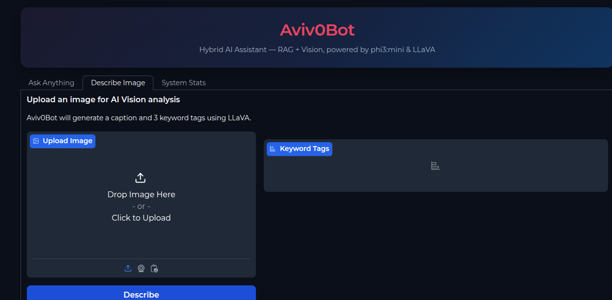
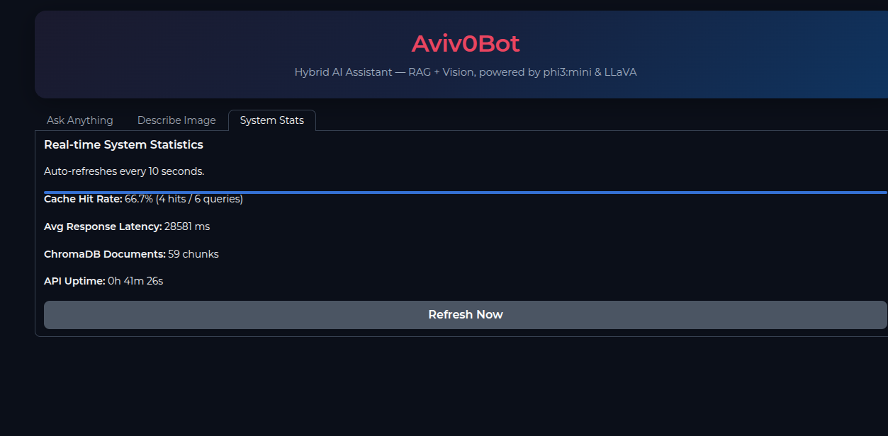

# AvivaBot — Hybrid AI Telegram Bot

> A production-grade, fully async AI assistant combining **RAG + Computer Vision**, event-driven via **Redis Streams**, with a beautiful **Gradio web frontend**.

---

## Screenshots

| Ask Anything (RAG) | Describe Image (Vision) | System Stats |
|---|---|---|
|  |  |  |

---

## 1. Architecture

```
┌─────────────────────────────────────────────────────────────────┐
│                         USERS                                   │
│         Telegram App              Gradio Web UI                 │
└────────────┬──────────────────────────┬────────────────────────┘
             │                          │ HTTP
             ▼                          ▼
  ┌─────────────────┐        ┌──────────────────────┐
  │ telegram_bot.py │        │  FastAPI Sidecar      │
  │  python-tg v20  │        │  /ask /vision /stats  │
  └────────┬────────┘        └──────────┬────────────┘
           │ XADD to Redis Streams       │ XADD
           ▼                            ▼
  ┌────────────────────────────────────────────────┐
  │              REDIS STREAMS                     │
  │  text_stream  ──►  rag-worker (consumer group) │
  │  image_stream ──►  vision-worker               │
  └────────────────────────────────────────────────┘
           │                            │
           ▼                            ▼
  ┌─────────────────┐        ┌───────────────────────┐
  │  rag_worker.py  │        │  vision_worker.py      │
  │                 │        │                        │
  │ 1. L1/L2 cache  │        │ 1. BLIP (local CPU)    │
  │ 2. Embed query  │        │ 2. ~1–3s per image     │
  │ 3. ChromaDB     │        │ 3. No Ollama needed    │
  │ 4. phi3:mini    │        │ 4. LPUSH result key    │
  │ 5. XACK         │        │ 5. XACK                │
  └────────┬────────┘        └───────────────────────┘
           │
           ▼
  ┌──────────────────────────┐
  │  Ollama (remote/local)   │
  │  phi3:mini — RAG answers │
  └──────────────────────────┘
           │
           ▼
  ┌──────────────────────────┐
  │  ChromaDB (persistent)   │
  │  all-MiniLM-L6-v2 embeds │
  │  cosine similarity top-k │
  └──────────────────────────┘
```

---

## 2. Tech Stack

| Component | Technology | Notes |
|-----------|-----------|-------|
| Telegram Bot | `python-telegram-bot` v20 | Fully async, handler-based |
| Message Queue | Redis Streams | At-least-once delivery, XACK |
| Vector Store | ChromaDB | Embedded, persistent, cosine search |
| Embeddings | `all-MiniLM-L6-v2` | 384-dim, fast CPU inference |
| RAG LLM | `phi3:mini` (Ollama) | 3.8B, instruction-tuned, CPU-capable |
| **Vision** | **BLIP** (`Salesforce/blip-image-captioning-base`) | **Local CPU, ~1–3s, no Ollama needed** |
| FastAPI Sidecar | FastAPI + uvicorn | Async, CORS, auto-docs at `/docs` |
| Web Frontend | Gradio 4.x | `share=True` gives instant public URL |
| Cache | In-memory LRU + Redis TTL | L1 (0ms) → L2 (1ms) → pipeline |
| Session History | Redis Lists | Rolling 3-turn window, 24hr TTL |
| Orchestration | Docker Compose | 8 services, named volumes, healthchecks |

---

## 3. Quick Start

### Prerequisites
- Docker & Docker Compose **or** Python 3.11+ with a local Redis
- Telegram Bot token from [@BotFather](https://t.me/BotFather)
- Ollama running `phi3:mini` (for RAG) — remote or local

### Setup

```bash
# 1. Clone the repo
git clone https://github.com/Rohan7530/Avivo-demo.git
cd Avivo-demo/avivo-bot

# 2. Create and configure .env
cp .env.example .env
# → Set TELEGRAM_BOT_TOKEN and OLLAMA_URL in .env

# 3. Install dependencies
pip install -r requirements.txt

# 4. Ingest knowledge base into ChromaDB (one-time)
PYTHONPATH=. python scripts/ingest_docs.py
```

### Run locally (4 terminals)

```bash
# Terminal 1 — FastAPI
PYTHONPATH=. uvicorn api.main:app --host 0.0.0.0 --port 8000 --reload

# Terminal 2 — RAG worker
PYTHONPATH=. python -m workers.rag_worker

# Terminal 3 — Vision worker (BLIP, local)
PYTHONPATH=. python -m workers.vision_worker

# Terminal 4 — Gradio frontend
PYTHONPATH=. python frontend/app.py
# → Watch logs for: Running on public URL: https://xxx.gradio.live
```

### Or: Docker Compose (all-in-one)

```bash
docker-compose up --build
docker-compose exec api python scripts/ingest_docs.py
```

---

## 4. Telegram Bot Commands

| Command | Description |
|---------|-------------|
| `/start` | Welcome message |
| `/help` | Show usage guide |
| `/ask <question>` | Ask anything from the knowledge base |
| `/image` | Upload an image for AI description |
| `/summarize` | Show your last 3 conversation turns |

---

## 5. Gradio Web UI

The Gradio frontend auto-generates a public `gradio.live` URL on startup — share it with anyone, no Telegram required.

**Three tabs:**
- **Ask Anything** — Submit RAG queries; answers include source document attribution
- **Describe Image** — Upload any image; BLIP generates a caption + 3 keyword tags locally in ~2s
- **System Stats** — Live cache hit rate, ChromaDB chunk count, API uptime (auto-refreshes every 10s)

Find your public URL in the Gradio terminal:
```
Running on public URL: https://xxxxxxxx.gradio.live
```

---

## 6. Adding Documents to the Knowledge Base

**Runtime (single document):**
```bash
curl -X POST http://localhost:8000/ingest \
  -H "Content-Type: application/json" \
  -d '{"doc_name": "my_policy.md", "doc_text": "Your document content..."}'
```

**Bulk (Markdown files):**
```bash
cp my_doc.md avivo-bot/docs/
PYTHONPATH=. python scripts/ingest_docs.py
```

---

## 7. System Design Notes

### Vision: BLIP (local) vs Ollama-based models

The vision pipeline uses **Salesforce BLIP** (`blip-image-captioning-base`, ~990 MB) which runs **entirely on your CPU** — no Ollama, no network calls, no timeouts.

| | Ollama LLaVA / qwen2.5vl | BLIP (current) |
|---|---|---|
| Latency | 30–120s (cold) | **~1–3s** |
| Requires Ollama | Yes | **No** |
| Runs offline | No | **Yes** |
| Quality | High detail | Good captions + tags |

### Caching Strategy

```
Query → L1 (in-memory LRU, 0ms) → L2 (Redis TTL, 1ms) → Full Pipeline (5–30s)
```

Cache key: `md5(query.lower().strip())` — normalised for robustness.  
Metric: `cache:hits` counter visible in the **System Stats** tab.

---

## 8. Environment Variables

Copy `.env.example` to `.env` and fill in:

| Variable | Description | Example |
|----------|-------------|---------|
| `TELEGRAM_BOT_TOKEN` | From @BotFather | `123456:ABC...` |
| `REDIS_URL` | Redis connection | `redis://localhost:6379` |
| `OLLAMA_URL` | Ollama server URL | `http://192.168.7.57:11434` |
| `LLM_MODEL` | RAG model name | `phi3:mini` |
| `EMBED_MODEL` | Embedding model | `all-MiniLM-L6-v2` |
| `CHROMA_DB_PATH` | Vector store path | `./chroma_db` |
| `CACHE_TTL` | Redis cache TTL (seconds) | `3600` |
| `FASTAPI_URL` | FastAPI URL for Gradio | `http://localhost:8000` |

> **Security:** `.env` is in `.gitignore` — your credentials are never committed. Only `.env.example` (with placeholder values) is tracked.

---

## 9. API Reference

| Method | Endpoint | Description |
|--------|----------|-------------|
| `GET` | `/health` | Service + Redis status |
| `POST` | `/ask` | Submit RAG query |
| `POST` | `/vision` | Submit image for description |
| `POST` | `/ingest` | Add document to knowledge base |
| `GET` | `/stats` | System metrics |

Interactive Swagger docs: `http://localhost:8000/docs`

---

## License

MIT License
